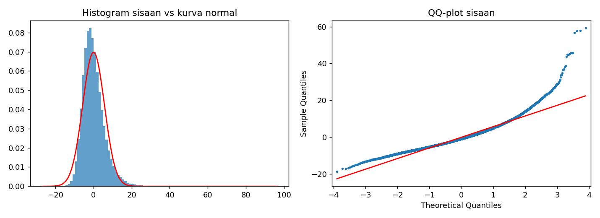
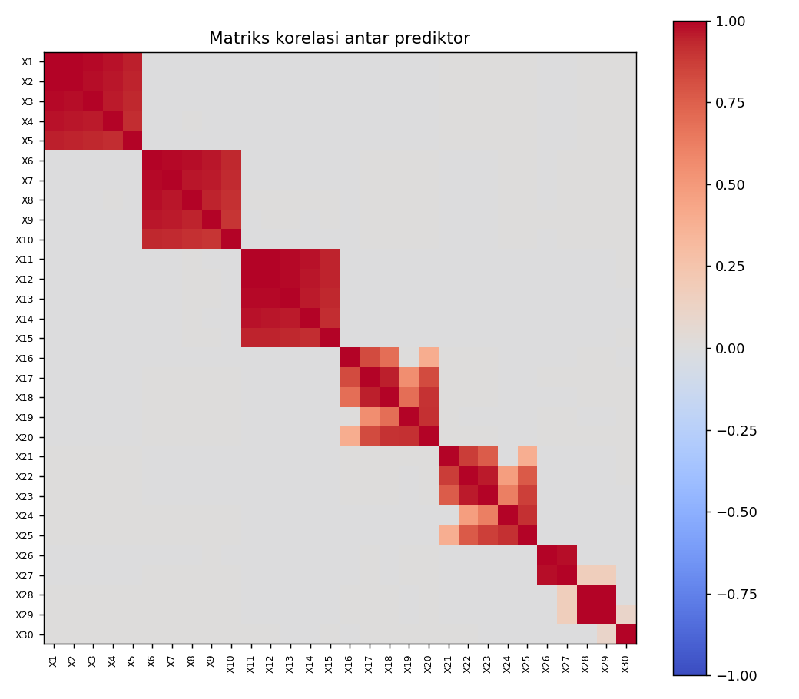
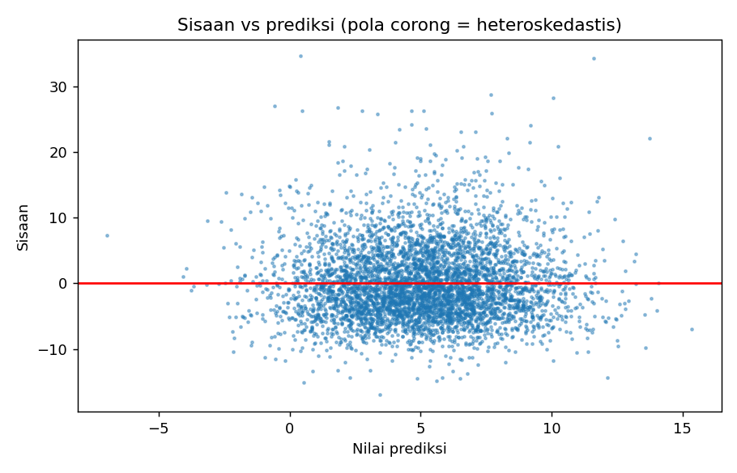
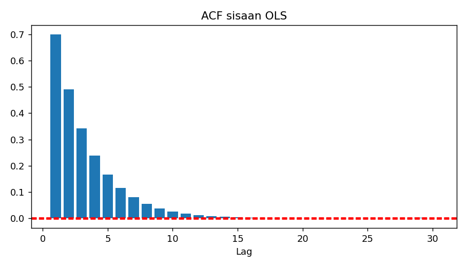
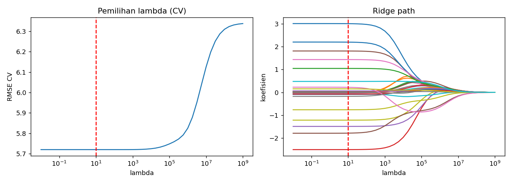

# Laporan Analisis Supervised Learning

## 1. Data dan pembagian data

Data terdiri dari **1.500.000 observasi**, 30 prediktor (X1–X30), dan satu variabel respons Y. Data dibagi secara **sequential**, dengan 80% data sebagai training dan 20% sebagai testing. Pembagian sequential dipertahankan karena urutan baris digunakan dalam diagnosis autokorelasi dan pemodelan GLS AR(1).

## 2. Model OLS sebagai baseline

Model OLS digunakan sebagai model awal sekaligus dasar untuk diagnosis residual. Hasil OLS memberikan:

- R² = **0,1866**
- Adjusted R² = **0,1866**
- p-value F-statistik < 0,001

Dengan demikian, model menjelaskan sekitar 18,66% variasi Y pada data training.

## 3. Uji asumsi

### 3.1 Normalitas residual

Hasil pengujian menunjukkan residual OLS tidak mengikuti distribusi normal:

| Uji | Statistik | Keputusan |
|---|---:|---|
| Jarque-Bera | 943.170,85 | Tolak H0 normalitas |
| D’Agostino-Pearson | 274.853,42 | Tolak H0 normalitas |
| Shapiro-Wilk (sampel 5.000) | W = 0,9486 | Tolak H0 normalitas |
| Skewness | 1,1429 | Menceng ke kanan |
| Kurtosis | 6,6931 | Lebih tinggi dari normal (= 3) |

Karena ukuran data sangat besar, uji formal sangat sensitif. Oleh karena itu, skewness, kurtosis, histogram, dan QQ-plot juga diperhatikan dalam interpretasi.

### 3.2 Multikolinearitas

Hasil VIF menunjukkan multikolinearitas yang kuat:

- **27 dari 30** prediktor memiliki VIF > 10.
- **30 dari 30** prediktor memiliki VIF > 5.
- Condition number = **57,8**.

Temuan ini menunjukkan bahwa banyak prediktor memiliki hubungan linear yang kuat satu sama lain. Kondisi tersebut terutama berpengaruh terhadap kestabilan koefisien dan menjadi alasan penggunaan Ridge Regression sebagai salah satu model pembanding.

### 3.3 Heteroskedastisitas

Hasil pengujian tidak sepenuhnya seragam antar prosedur:

| Uji | Hasil | Interpretasi |
|---|---:|---|
| Breusch-Pagan | LM = 31,22; p = 0,4048 | Tidak menolak homoskedastisitas |
| White ringkas | LM = 750,17; p ≈ 1,27×10⁻¹⁶³ | Ada indikasi heteroskedastisitas |
| White penuh, 20.000 sampel | LM = 1.442,84; p ≈ 1,96×10⁻⁹³ | Ada indikasi heteroskedastisitas |

Dengan demikian, Breusch-Pagan tidak menemukan bukti yang cukup, sedangkan kedua versi White menunjukkan adanya ketidak-konstanan varians residual. WLS kemudian digunakan sebagai salah satu alternatif model.

### 3.4 Autokorelasi

Autokorelasi merupakan temuan yang kuat:

| Uji | Hasil |
|---|---:|
| Durbin-Watson | **0,6000** |
| rho lag-1 | **0,7000** |
| Breusch-Godfrey, 5 lag | LM = **587.984,52**, p < 0,001 |
| Ljung-Box, 10 lag | Q = **1.149.757,65**, p < 0,001 |

Hasil tersebut menunjukkan adanya autokorelasi positif yang kuat pada residual. Karena itu, GLS dengan struktur AR(1) digunakan sebagai alternatif yang secara khusus mempertimbangkan korelasi residual.

## 4. Pemodelan

Empat model dibandingkan:

1. **OLS** sebagai baseline.
2. **WLS** untuk merespons indikasi heteroskedastisitas.
3. **GLS (AR1)** untuk merespons autokorelasi residual.
4. **Ridge Regression** untuk mengurangi dampak multikolinearitas.

### 4.1 Perbandingan hasil model

| Model | RMSE Train | RMSE Test | AIC Native | AIC Common | df Efektif |
|---|---:|---:|---:|---:|---:|
| OLS | 5,7195 | 5,7012 | 7.590.810,84 | 7.590.810,84 | 31,00 |
| WLS | 5,7195 | 5,7012 | 7.590.814,27 | 7.590.810,84 | 31,00 |
| GLS (AR1) | 5,7195 | 5,7012 | 6.782.799,35 | 7.590.834,32 | 32,00 |
| Ridge | 5,7195 | 5,7012 | 7.590.810,81 | 7.590.810,81 | 30,98 |

RMSE dihitung pada skala Y asli sehingga dapat dibandingkan antar model. Nilai RMSE test berada pada kisaran **5,7012** untuk seluruh model dan perbedaannya sangat kecil.

Untuk AIC, **AIC native tidak sepenuhnya sebanding** antara OLS dan model yang menggunakan pembobotan atau transformasi. Oleh karena itu, AIC common pada skala residual asli juga dilaporkan sebagai pembanding tambahan.

## 5. Ridge Regression

Ridge menggunakan standardisasi prediktor dan pemilihan lambda melalui **5-fold cross-validation berbasis blok berurutan**.

Hasil pemilihan:

| Parameter | Hasil |
|---|---:|
| Metode | 5-fold cross-validation |
| Lambda optimal | **10** |
| Effective degrees of freedom | **30,98** |
| Jumlah parameter awal | **31** |

Lambda optimal yang relatif kecil membuat hasil Ridge sangat dekat dengan OLS. Hal ini terlihat dari RMSE test yang hampir sama.

## 6. Pembahasan

Hasil diagnosis menunjukkan beberapa karakteristik penting pada data. Residual OLS tidak normal, multikolinearitas antar prediktor kuat, dan terdapat indikasi heteroskedastisitas berdasarkan White test meskipun Breusch-Pagan tidak signifikan. Temuan paling kuat adalah autokorelasi positif pada residual.

Keempat model memiliki performa prediksi yang sangat berdekatan. RMSE test OLS adalah sekitar 5,7012, WLS sekitar 5,7012, GLS (AR1) sekitar 5,7012, dan Ridge sekitar 5,7012. Jadi, perubahan metode tidak menghasilkan perubahan besar pada akurasi prediksi untuk data uji ini.

Perbedaan model lebih terkait dengan masalah yang ingin ditangani. OLS menjadi baseline; WLS menggunakan informasi mengenai varians residual; GLS AR(1) memasukkan struktur korelasi residual; sedangkan Ridge memberikan regularisasi untuk menghadapi multikolinearitas.

AIC common OLS, WLS, dan Ridge juga sangat berdekatan, sedangkan nilai GLS common sedikit lebih tinggi. Perbedaan ini perlu dibaca bersama tujuan model dan struktur error, bukan hanya sebagai ukuran tunggal performa.

## 7. Kesimpulan

Berdasarkan hasil analisis, data menunjukkan penyimpangan terhadap beberapa asumsi OLS, yaitu:

1. residual tidak normal;
2. multikolinearitas kuat antar prediktor;
3. terdapat indikasi heteroskedastisitas menurut White test, meskipun Breusch-Pagan tidak signifikan; dan
4. terdapat autokorelasi positif yang kuat.

Untuk merespons karakteristik tersebut, dilakukan perbandingan **OLS, WLS, GLS (AR1), dan Ridge Regression**. Keempat model menghasilkan RMSE test yang hampir sama, sekitar **5,7012**. Dengan demikian, pada data ini pergantian metode tidak memberikan perbedaan besar pada akurasi prediksi.

Pemilihan metode selanjutnya lebih terkait dengan karakteristik yang ingin ditangani: WLS untuk struktur varians, GLS AR(1) untuk autokorelasi, dan Ridge untuk regularisasi pada kondisi multikolinearitas. OLS tetap digunakan sebagai baseline pembanding.

## 8. Output

Seluruh grafik dan tabel hasil analisis tersedia pada folder `output/`:

- `output/figures/01_normalitas.png`
- `output/figures/02_korelasi_vif.png`
- `output/figures/03_heteroskedastisitas.png`
- `output/figures/04_acf_sisaan.png`
- `output/figures/05_ridge.png`
- `output/tables/model_comparison.csv`
- `output/tables/coefficients.csv`
- `output/tables/vif.csv`
